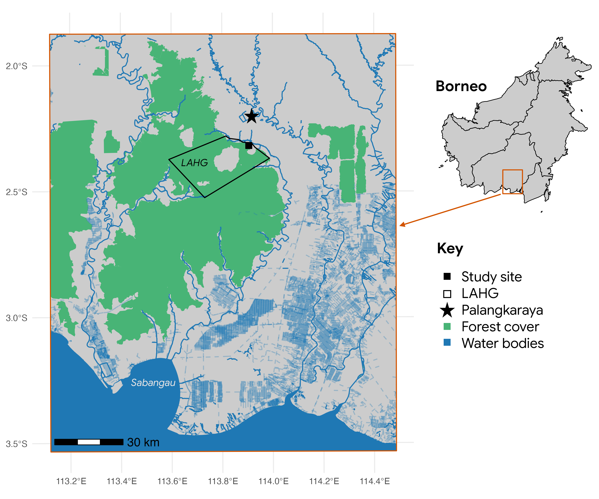
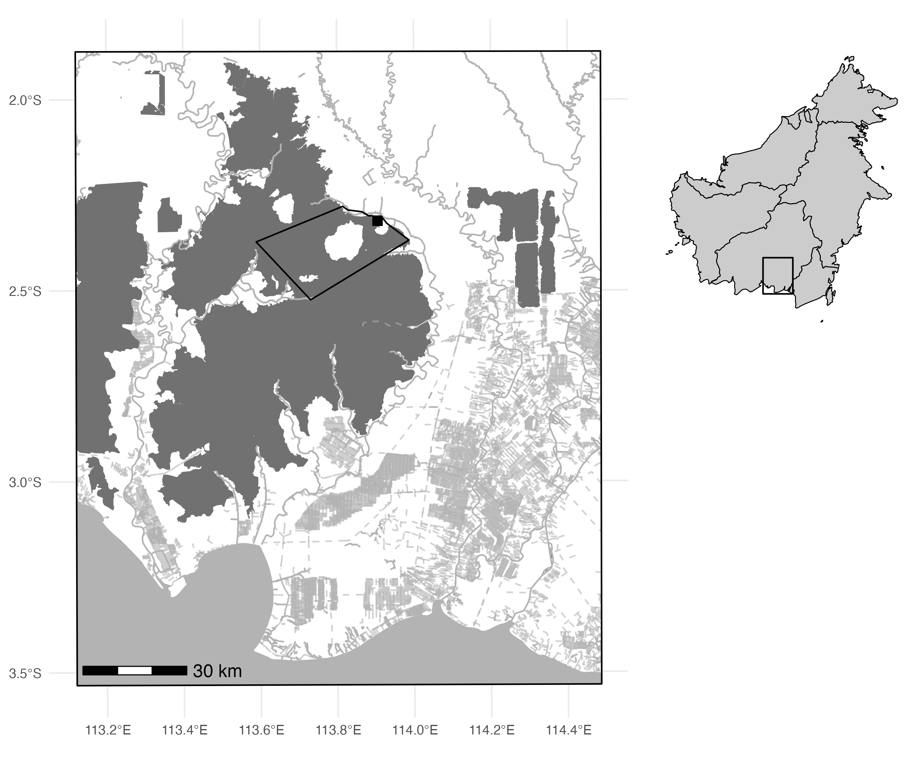

# Bornean Orangutan Medicinal Diet Analysis

This repository contains the R code used to generate the spatial visualizations for a forthcoming paper titled **"Investigating Medicinal Resource Combinations in the Bornean Orangutan Diet"** by Allen et al. (2026).

---
  
  ## Project Overview
  
  This project is part of a study investigating the **Self-Medicative Resource Combinational Hypothesis (SMRCH)** in wild Bornean orangutans (*Pongo pygmaeus*). Using 20 years of focal observation data from the Sebangau peat-swamp forest in Central Kalimantan, we analyzed non-random dietary combinations of plants with documented ethnomedicinal properties.

The provided scripts generate the study site maps (Figure 1), highlighting the **Natural Laboratory for the Study of Peat Swamp Forest (LAHG)** and the specific **9 km² study area** where over 20,000 hours of behavioral data were collected.

---
  
## Visualizations
  
The repository includes the following map outputs:
  
### 1. Color Forest Map
  
Used for digital presentations and general reference.



### 2. Black and White Forest Map

Formatted specifically for print publication.



**Note on Aesthetics:**  
  The map keys were post-processed in Adobe Photoshop to meet specific journal aesthetic requirements. For users wishing to make further manual adjustments, the source file `Borneo_Forest_Map.psd` is included in this repository.

---
  
## Files
  
| File | Description |
|------|-------------|
| `Fig1.R` | Primary script for processing spatial data (using `sf`, `ggplot2`, and `ggspatial`) and generating the color version of the study site map. |
| `Fig1_bw.R` | Specialized script that builds upon `Fig1.R` to produce a high-contrast black and white version suitable for formal publication. |
| `Borneo_Forest_Map.psd` | Editable Photoshop file containing the manually refined legend and map keys. |
  
---
  
## Requirements
  
To run the R scripts, you will need the following libraries:
  
- `sf`  
- `dplyr`  
- `ggplot2`  
- `ggspatial`  
- `rnaturalearth`  
- `cowplot`  

Install them in R using:
  
```r
install.packages(c("sf", "dplyr", "ggplot2", "ggspatial", "rnaturalearth", "cowplot"))
```

**Citation**
  
Allen, G., Freymann, E., d’Oliveira Coelho, J., Shagara, H., Shinyo, I., Panda, A., Jaya, A., Hockings, K. J., & Morrogh-Bernard, H. C. (2026). *Investigating Medicinal Resource Combinations in the Bornean Orangutan Diet.* In Preparation.